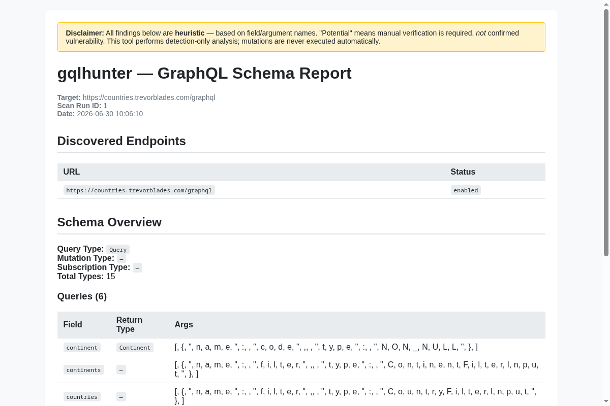
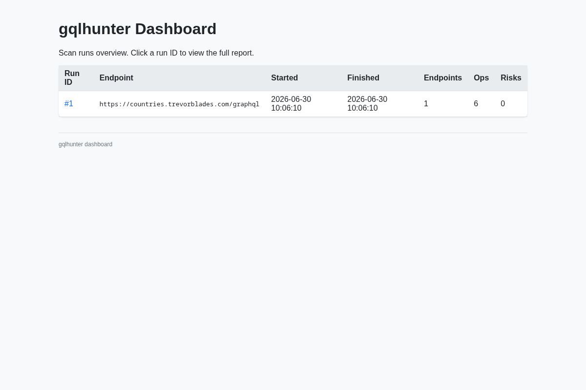
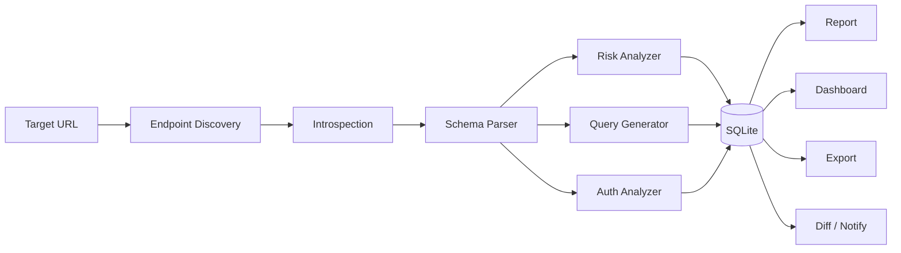

<p align="center">
  
  
  
  
  
  
</p>

<p align="center">
  <a href="#demo"></a>
  <a href="#quick-start"></a>
  <a href="#commands"></a>
  <a href="https://github.com/bess1lie/bounthunt"></a>
</p>

<h1 align="center">gqlhunter</h1>

<p align="center">
  <b>GraphQL recon & analysis CLI for bug bounty programs.</b><br>
  <i>Discover · Introspect · Analyze · Report.</i>
</p>

---

## Demo

```text
$ gqlhunter discover https://example.com --scope scope.yaml
╭───────────────── Discovered GraphQL Endpoints ─────────────────╮
│ URL                                        │ Status           │
├────────────────────────────────────────────┼──────────────────┤
│ https://example.com/graphql                │ 200 OK           │
│ https://example.com/api/graphql            │ 404 Not Found    │
│ https://example.com/graphiql               │ 200 OK           │
╰────────────────────────────────────────────┴──────────────────╯

$ gqlhunter scan https://example.com/graphql
╭────────────────────── Scan Summary ──────────────────────╮
│ Schema: 12 types, 8 queries, 3 mutations                │
│ Risk findings: 2 high, 1 medium, 3 low                  │
│ Auth: accessible without token                          │
╰──────────────────────────────────────────────────────────╯

$ gqlhunter dashboard --db gqlhunter.db
Dashboard started at http://127.0.0.1:8080
```

 | 
--- | ---

[Sample HTML report](screenshots/report.html)

---

## Why gqlhunter?

GraphQL APIs expose the entire data model through a single endpoint. Manual testing means copy-pasting introspection queries, reading JSON schemas by hand, and guessing which fields are dangerous.

gqlhunter automates the ground work: endpoint discovery, schema introspection, risk classification (by field-name heuristics), IDOR candidate detection, auth analysis, and change tracking across scan runs.

It complements Burp Suite and GraphQL Voyager by handling the recon layer before you dive deeper.

---

## Comparison

| Feature | Manual Workflow | GraphQL Voyager | gqlhunter |
|---------|---------------|-----------------|-----------|
| Endpoint discovery | ❌ | ❌ | ✓ |
| Introspection | Manual query | ✓ | ✓ |
| Risk heuristics | ❌ | ❌ | ✓ |
| IDOR candidates | ❌ | ❌ | ✓ |
| Auth comparison | Manual | ❌ | ✓ |
| Session persistence | ❌ | ❌ | ✓ |
| Schema diff | ❌ | ❌ | ✓ |
| Dashboard | ❌ | ❌ | ✓ |
| SARIF export | ❌ | ❌ | ✓ |

---

## Architecture



| | | | |
|---|---|---|---|
| <b>195+</b><br>Tests | <b>10</b><br>CLI Commands | <b>18</b><br>Discovery Paths | <b>7</b><br>Database Tables |

---

## Features

### 🔍 Discovery
Scans 18 common GraphQL paths — `/graphql`, `/graphiql`, `/api`, and custom endpoints.

### 📐 Schema
Full introspection with configurable depth. Parses and stores types, queries, mutations, and subscriptions. Cyclic schema guard prevents infinite recursion.

### 🧠 Analysis
Risk classification based on field names (`delete*`, `admin*`, `reset*`). IDOR candidate detection via argument heuristics. Read-only query and mutation generator.

### 🔑 Auth
Compares identical queries with and without credentials. Persistent session save/load for long-running assessments.

### 🔁 Diff & Export
Schema diff across scan runs (Added / Modified / Removed). Export to JSON (no tokens leaked) or SARIF 2.1.0.

### 📊 Reporting
Markdown and HTML reports via Jinja2 (XSS-guarded). Findings grouped by severity, filterable via `--severity`.

### 🖥️ Dashboard
Built-in web dashboard — scan history, per-run drill-down, severity filters.

### 📬 Notifications
Template-based Slack, Telegram, and webhook notifications.

### 🐳 Docker
Ready-to-use Dockerfile and docker-compose.

---

## Use Cases

- **Bug Bounty Hunter** — Find IDOR candidates, public endpoints, risky mutations
- **Penetration Tester** — Schema analysis, auth bypass, SARIF for reporting
- **DevSecOps** — Track schema changes across deployments, CI integration
- **Developer** — Understand what your GraphQL API exposes before attackers do

---

## Quick Start

```bash
# Install
pip install gqlhunter

# Or Docker
docker build -t gqlhunter .
docker run --rm -v .:/app gqlhunter --help
```

### Define scope

```yaml
# scope.yaml
targets:
  - https://example.com
  - https://api.example.com
allowlist:
  - https://example.com/graphql/public
deny:
  - /admin
```

### Full scan

```bash
gqlhunter scan https://example.com/graphql --scope scope.yaml
gqlhunter scan https://example.com/graphql --max-depth 5
```

---

## Commands

| Command | Purpose |
|---------|---------|
| `discover` | Find GraphQL endpoints on a target |
| `scan` | Introspection + schema analysis + risk classification |
| `auth` | Compare authenticated vs anonymous responses |
| `variants` | Generate query variants (single / combinations / random) |
| `report` | Generate HTML or Markdown report |
| `export` | Export findings to JSON or SARIF |
| `diff` | Compare schema across scan runs |
| `notify` | Send notifications via Slack / Telegram / Webhook |
| `dashboard` | Launch web dashboard |
| `batch` | Run scan across multiple targets |

---

## Design Decisions

### Cyclic schema protection
Uses `max_depth` counter (default 3) instead of tracking visited types. Simpler and predictable — any chain longer than 3 levels is truncated. Acceptable for lightweight recon sampling.

### Auth analysis: same-payload comparison
Always sends identical query with and without the Authorization header. Never substitutes different `id` values — eliminates false positives. Guardrail test proves only the header changes.

### Structural args comparison in diff
`diff` compares `args_json` structurally (`json.loads`) not by raw string — prevents false `MODIFIED` entries from JSON key reordering.

### XSS protection in HTML reports
Jinja2 auto-escape enabled for all `["html", "xml"]`. Confirmed by `test_script_in_operation_name_is_escaped`.

---

## Releases

### v0.2 — Current Release
- [x] Auth persistence · Query variants · Dashboard · SARIF · 195 tests

### v0.3 — Next
- [ ] Batch diff over N runs
- [ ] WebSocket subscription tester
- [ ] VS Code extension (inline severity badges)
- [ ] REST → GraphQL bridge detection

---

## Project Structure

```
gqlhunter/
├── cli.py           # Typer CLI
├── auth/            # Authentication analysis
├── core/            # SQLite · HTTP · scope
├── dashboard.py     # Web dashboard
├── discovery/       # Endpoint discovery
├── generator/       # Query variants
├── introspection/   # GraphQL introspection
├── notify/          # Slack · Telegram · Webhook
├── report/          # HTML · Markdown · SARIF
├── schema/          # Schema parser
└── variants/        # Variant engine
```

---

## Ethics

> Designed for **authorized security testing only**. Detection-only — never auto-executes mutations or brute-forces credentials.

---

<p align="center"><b>gqlhunter</b> — GraphQL recon, automated. · <i>Sister project:</i> <a href="https://github.com/bess1lie/bounthunt">bounthunt</a> · <a href="LICENSE">MIT License</a> · <a href="https://github.com/bess1lie">bess1lie</a></p>
